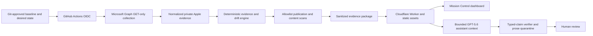

# Architecture

EvidenceOps separates collection, deterministic evaluation, publication policy, generated
analysis, and human judgment so no layer silently inherits another layer's authority.

## Provider contract

The vendor-neutral provider interfaces expose `collect` only. The Apple-focused Intune provider
uses Microsoft Graph v1.0 wherever available and isolates one documented beta dependency for
Settings Catalog. It covers managed-device aggregates, legacy and Settings Catalog configuration,
compliance policies, managed apps and application-policy metadata, enrollment configuration,
device categories, Automated Device Enrollment, Apps and Books token health, APNs certificate
health, assignments, and scheduled actions. Resource-family adapters normalize materially
different response shapes independently. Settings Catalog normalization walks Microsoft's bounded,
documented group/choice/simple instance tree and emits scalar child settings as individual evidence
records. Container definition IDs never substitute for their configured child definitions. A
well-formed non-Apple policy is filtered from this Apple slice without declaring the Apple
collection incomplete; an unknown platform or unsupported value shape still fails closed.

The common Graph client implements pagination, bounded retry with jitter and `Retry-After`, request
timeouts, same-host/version next-link validation, and structured 401/403/404/409/429/5xx errors.
The Apple collector limits concurrency to four operations and converts an unavailable resource or
unsupported shape into an explicit collection-gap record. It does not dump raw responses. A later
Jamf or Workspace ONE adapter can produce the same evidence model.

## Baseline and deterministic evidence engine

The pinned baseline inventory comes from mSCP revision
`11b5896e4f12f43410686024f543792742562c91`. Its source artifact and extracted inventory hashes are
verified at test time. The repository contains a machine-readable internal TMCO Consulting demo approval for
the complete 98-rule macOS inventory. Four settings currently have exact reviewed provider
mappings; a fifth desired mapping remains explicitly unreviewed. Only reviewed mappings can drive
deterministic findings. Unsupported rules stay visible and do not enter the alignment denominator. iOS and
iPadOS posture is visible but is not scored against the macOS baseline.

The engine compares only explicitly mapped normalized values and assignment evidence. Every
finding links the baseline requirement, source evidence IDs, Git SHA, algorithm version, and
fingerprints. Outcomes include aligned, missing, value drift, assignment drift, conflict,
collection gap, unsupported, not applicable, and human review. These describe technical evidence
relationships—not framework or organizational compliance. A model never selects an outcome.

Mission Control presents the approved CIS Level 1 desired state beside the normalized observed
state in a dense operational view. Its STIG selector is a comparison lens over already reviewed
technical cross-references, not a loaded STIG baseline, assessment, or score. A real baseline switch
requires a pinned authoritative release, human approval, reviewed requirement mappings, and exact
provider mappings before any STIG rule enters deterministic evaluation.

## Private-to-public boundary

Live collection creates no generic raw export. It normalizes classified fields, keeps source IDs
only in the private package when needed for joins, and writes that package only to a selected
Git-ignored directory with mode `0700`/`0600` where supported. Publication is a separate command
requiring an ephemeral pseudonymization key.

The public Mission package is constructed from an allowlist rather than by deleting fields from a
raw object. Unknown fields stop validation. Public and pre-model scans reject identities,
credentials, tenant-specific values, URLs containing source IDs, and other prohibited data. The
package records its policy version and canonical SHA-256 identity.

## Cloudflare application boundary

`mkdocs build --strict` produces the scanned `site/` Static Assets directory. GitHub Pages is
retired. The exact-pinned Cloudflare Worker runs first only for `/api/*`; static assets otherwise
remain direct-serving.

`/api/health` reports process liveness. `/api/ready` validates the runtime configuration and
fingerprint-verified Mission package. `/api/status` exposes a deliberately small, non-secret status
contract derived from that package. `/api/narrative` verifies a complete public evidence package.
`/api/ask` accepts only a bounded question and current snapshot ID, loads the validated package
server-side, classifies a closed set of evidence intents, and constructs a small intent-specific
context. Both POST routes enforce exact methods and JSON shape, same-origin,
compressed/body-size rejection, content scans, native per-client and global rate limits, timeout
and output bounds, and generic errors.

Production pins `gpt-5.6-terra`; the project service-account key exists only as the encrypted Worker
secret `OPENAI_API_KEY`. Fixture mode performs no model request and never silently substitutes for
a failed live request. Static assets carry repository-controlled CSP, HSTS, and browser security
headers in `docs/_headers`; JSON API responses set the corresponding restrictive controls in code.

## AI and verifier boundary

The OpenAI Responses API request uses `store: false`, no tools, low reasoning effort, strict JSON
schema output, and a bounded context containing only sanitized facts and allowed references. The
verifier treats model output as untrusted. Typed claims must exactly equal deterministic expected
claims, evidence references must remain in-package, unsupported verdict language is rejected, and
all explanatory prose remains generated and quarantined for human review.

## GitHub and Entra trust boundary

Public CI has `contents: read` and no tenant or model credential. The manual Intune workflow checks
out trusted `main`, targets the protected `production` environment, and uses the exact
environment-scoped GitHub OIDC subject. The expanded collector requires four documented read-only
application permissions: configuration, managed devices, managed applications, and service
configuration. It never uses a client secret and cannot run on pull-request code.

## Modules

| Module | Responsibility | Intentional exclusion |
| --- | --- | --- |
| `domain` | Strict schema-v1 evidence object types | Vendor SDK objects |
| `baselines` | Pinned mSCP inventory, demo approval, and reviewed mappings | Certification or GPT-created crosswalks |
| `providers` | Vendor-neutral contracts and GET-only Intune adapters | Writes, raw exports, public identities |
| `evidence` | Reproducible drift, Mission packages, history summary, and fingerprints | Model inference |
| `sanitization` | Explicit classification and public/model egress gates | Key persistence |
| `narrative` / Worker assistant | Structured explanation and deterministic verification | Remediation, approval, or compliance verdicts |
| `cli` | Synthetic, private collection, publication, narrative, verification, and build workflows | Apply or silent fallback |

## Compatibility

Phase 0 and the original Phase 1 schema-v1 objects remain available. Mission Control adds a strict
schema-v2 public projection without changing legacy object identities. Unknown fields, incompatible
versions, and tampered fingerprints fail closed.
